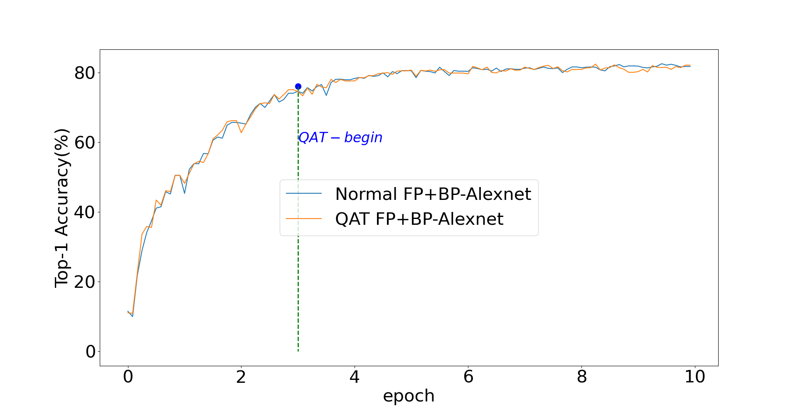
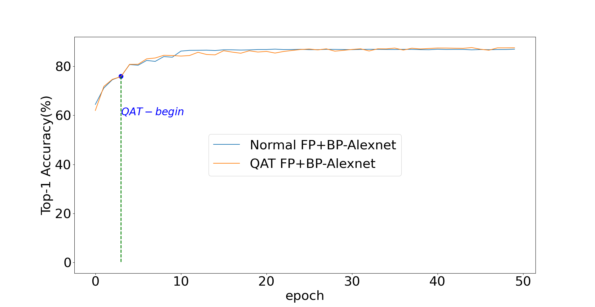

# Quantization-aware-Training 
This module is about the 8-bit Quantization-aware-Training (QAT) for both forward and backward propagation stages.  
The demo codes are based on AlexNet with CIFAR-10 dataset.  
QAT compresses the model parameters and gradients for FP and BP, respectively.

**Alexnet_qat  Folder Structure:**  

* `Alex_qat.py`     : main entry of QAT training on alexnet
 
* `Timer.py`        : information log and time tools used in training procudre

* `config.py`       : configuration of this project  
 
* `quantizerAlex.py`: quantizer API  
                
**Demo Results:**

